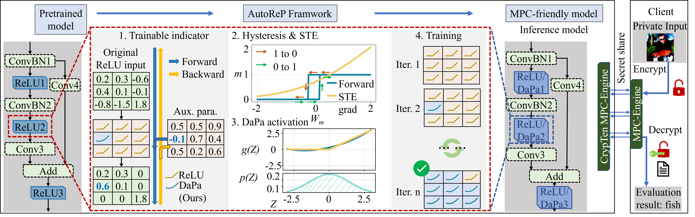

# Official implementation of "AutoReP: Automatic ReLU Replacement for Fast Private Network Inference"

Please cite our paper if you use the code ✔
```
@inproceedings{peng2023autorep,
  title={AutoReP: Automatic ReLU Replacement for Fast Private Network Inference},
  author={Peng, Hongwu and Huang, Shaoyi and Zhou, Tong and others},
  booktitle={Proceedings of the 2023 International Conference on Computer Vision(ICCV)},
  year={2023}
}
```

<!--  -->


# ReLU Reduction/ ReLU Peplacement


Some steps to setup the environment and download dataset
```bash
# Create a environment
conda create --name AutoReP
#or
conda create --prefix=${HOME}/.conda/envs/AutoReP python=3.9
# Then activate the environment
conda activate AutoReP
# Install pytorch package
conda install -y pytorch==1.12.0 torchvision==0.13.0 torchaudio==0.12.0 cudatoolkit=11.6 -c pytorch -c conda-forge
# Install tensorboard to record accuracy/loss stuffs
conda install -c conda-forge tensorboardx
pip install tqdm pytorch_warmup
pip install scipy
```

Download Tiny-ImageNet dataset:
```bash
bash dataset_download/download_tinyimagenet.sh
```

## 1. Train a baseline models
Ways to repeat the pretrained model experiment:
```bash
bash scripts/scripts_baseline.sh
```
- You should specify "```--act_type nn.ReLU```" to run the baseline model by using ReLU non-linear function. 
- You can speicify which gpu you will be used by changing "```--gpu 0```". In the scripts, "```nohup python > out.log```" put the execution of python program into background, and direct the command line output to out.log. <br /> 
- You may need to change the dataset path
- Model and logging path can be found in: ```./train_cifar/wide_resnet_22_8__tiny_imagenet```
## Add Hysteresis Loop into Gated Mask function:
The forward part of gated mask is a hysteresis loop function rather than simple gated mask as ```f(x) = x > 0```. The backward follows the same STE function as gated mask backward. 

The hysteresis function looks like this: 


The hysteresis function can be described as:
```python
def Hysteresis(now_state, in_val, threshold):
    if now_state == 1:
        if in_val < (-1) * threshold:
            now_state = 0
    else:
        if in_val > threshold:
            now_state = 1
    return now_state
```
The threshold is a hyper-parameter to adjust the width of hysteresis loop. 

 

## 2. Run AutoReP with DaPa based Polynomial function (c<sub>2</sub>x<sup>2</sup> + c<sub>1</sub>x + c<sub>0</sub>) with hysteresis loop:

Here are the steps to run the AutoReP with proposed function for WideResNet-22-8 on Tiny-ImageNet dataset for 150K ReLU budget: 
```bash
bash scripts/wide_resnet_22_8__tiny_imagenet_dapa2_distil_split_lr_final.sh
```
- You can change the number of epochs to get a higher accuracy but with a longer training time. 
- Model and logging path can be found in: ```./train_cifar_dapa2_distil_relay/wide_resnet_22_8_wide_resnet_22_8_tiny_imagenet_relay_0.003/cosine_ReLUs150.0wm_lr0.001mep80_baseline```


