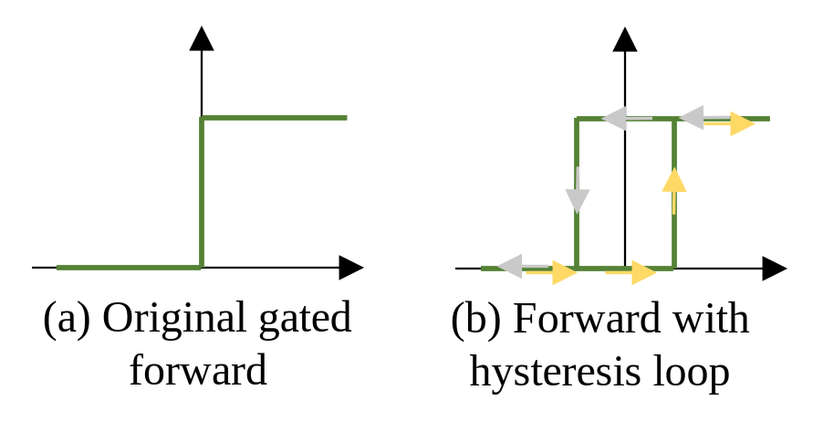

# ReLU Reduction/ ReLU Peplacement


Some steps to setup the environment 
```bash
# Create a environment
conda create –name torchenv
#or
conda create --prefix=${HOME}/.conda/envs/torchenv python=3.9
# Then activate the environment
conda activate torchenv
# Install pytorch package
conda install -y pytorch==1.12.0 torchvision==0.13.0 torchaudio==0.12.0 cudatoolkit=11.6 -c pytorch -c conda-forge
# Install tensorboard to record accuracy/loss stuffs
conda install -c conda-forge tensorboardx
pip install tqdm pytorch_warmup
```
The working folder can be found in "```/data3/hop20001/MPC_sparse_act/ACT_Prune_cleaned_v3```" on ```137.99.3.174```, the folder is set to be visible for any user, so you can load pretrained models or look at results from the working folder. 

## 1. Train a baseline models
Ways to repeat the pretrained model experiment:
```bash
bash scripts/scripts_baseline.sh
```
- You should specify "```--act_type nn.ReLU```" to run the baseline model by using ReLU non-linear function. 
- You can speicify which gpu you will be used by changing "```--gpu 0```". In the scripts, "```nohup python > out.log```" put the execution of python program into background, and direct the command line output to out.log. <br /> 

- The model architecture is specified through "```--arch resnet18```", and the basic architectures can be found in folder locaded in "```models_cifar```". "```resnet18```" architecture is located in "```models_cifar/resnet_basic.py```", which is a smaller version. "```ResNet18```" architecture is located in "```models_cifar/resnet.py```", which is a larger version. 

- For cross-work comparison, Fig. 4 of "Selective Network Linearization for Efficient Private Inference" (denoted as ```SNL```) has the ReLU count for their version of ResNet-18 on CIFAR-10, and it seems that the model is different from both of our "```resnet18```" and "```ResNet18```" model version, the size is in the middle of "```resnet18```" and "```ResNet18```" model. 
- The checkpoint and log file location folder: <br />
"```train_cifar/resnet18__cifar10/cosine_baseline_sp0.0lr0.1ep400_baseline```" (ACC ``` 93.84%```) <br />
"```train_cifar/ResNet18__cifar10/cosine_baseline_sp0.0lr0.1ep400_baseline```" (ACC ``` 95.75%```) <br />

## 2. Run purely ReLU pruning (Optional):
The experiment is extremely hard to tune, but here are few versions that I tuned successfully to compete with SNL paper:  
- Step 1: ReLU replacement mask training ("```resnet18```"): 

    ```bash
    bash scripts/scripts_relu_prune.sh
    ```
    - The pruning is done based on pretrained "```resnet18```" model, which is a smaller version of ResNet-18 on CIFAR-10. We use following command line argument to specify the pretrained model: "``` --pretrained_path ./train_cifar/resnet18__cifar10/cosine_baseline_sp0.0lr0.1ep400_baseline/best.pth.tar ```"
    - In this experiment, we only conduct mask training, we didn't do any finetune training. "```--w_mask_lr 0.02```" is used to specify weight learning rate of the mask training process. "```--w_lr 0.1```" is for weight learning rate of the finetune process. "```--mask_epochs 100```" is the number of epochs of mask training process. "```--epochs 0```"  is the number of epochs of finetune process. 
    - There are 4 python command runned in the scripts. We use "```--sparsity 0.5```" to specify the ReLU sparsity of the model. We use "```--mask_dropout 0.01```" to specify the ReLU mask dropout probability. The mask dropout ratio specifies the probability that the ReLU mask is not applied, which means the original ReLU will be used instead of masked ReLU. The dropout ratio serves as a regularization just like L2 norm or L1 norm of weight. 
    With dropout, the accuracy might be 0.0~0.2% higher than the baseline version. 
    - "```--act_type ReLU_masked_spgrad```" specifies the module which will replacement the original ReLU model. All modules can be found in "```models_util/model_spReLU.py```". The "```ReLU_masked```" is the ReLU module with trainable mask to prune ReLU elements, and the pruned elements has ```f(x) = x``` for both forward and backward. "```ReLU_masked_spgrad```" is a improved version of ReLU module with trainable mask to prune ReLU elements, where the forward is ```f(x) = x```, but the backward follows the original gradient of ```f(x) = ReLU(x)``` to mimic the original gradient or ReLU function. In the experiment we use "```ReLU_masked_spgrad```" module. 
    - The observations is that "```ReLU_masked_spgrad```" module can help the ReLU pruned model to perform better in cases where ReLU prunning ratio is not high (for example, 0.5). However, the effectness of "```ReLU_masked_spgrad```" and "```ReLU_masked```" are similar at extreme pruning ratio (for example, 0.9). We can assume that the "```ReLU_masked_spgrad```" module serves as some kind of regularization just like L2 norm or L1 norm of weight, and it's useful for low ReLU pruning ratio cases. 
    - There are some other parameters which are important, but are already tuned to the near optimal combinations. All command line argument can be found in "```util_func/config.py```". <br /> 
    "```--alpha_lr```" specifies the mask weights' learning rate during mask training process. Under current value ```2e-4```, the mask will converge in 25-35 epochs. <br />
    "```--lamda```" is the loss penalty for ReLU replacement ratio: ```loss = ce_loss + lamda * ReLU_density```. The higher the penalty, the faster the mask will converge but it might be more unstable. The current value ```1e1``` gives a good trade-off between convergence rate and stability. 
    - The checkpoint and checkpoint with best acc will be saved as long as the mask sparsity is converged to the given value. 
We ran 4 combinations in the bash scripts : <br />
<span style="color:red;">(Results are not up to date and need re-run, as we changed the forward function)</span> <br />
    "```--sparsity 0.5 --mask_dropout 0.01```" (ACC ``` 92.26%```) <br />
    "```--sparsity 0.9 --mask_dropout 0.01```" (ACC ``` 88.89%```) <br />
    "```--sparsity 0.95 --mask_dropout 0.01```" (ACC ``` 87.59%```) <br />
    "```--sparsity 0.5 --mask_dropout 0.00```" (ACC ``` 92.12%```) <br />
    "```--sparsity 0.9 --mask_dropout 0.00```" (ACC ``` 88.88%```) <br />
    "```--sparsity 0.9 --mask_dropout 0.00```" (ACC ``` 87.70%```) <br />
    

    - The checkpoint and log file location folder: <br />
<span style="color:red;">(Results are not up to date and need re-run, as we changed the forward function)</span> <br />
"```train_cifar/resnet18__cifar10/cosine_mask_dropout_0.01sp0.5wm_lr0.02mep100_baseline```" (ACC ``` 92.26%```) <br />
"```train_cifar/resnet18__cifar10/cosine_mask_dropout_0.01sp0.9wm_lr0.02mep100_baseline```" (ACC ``` 88.89%```)<br />
"```train_cifar/resnet18__cifar10/cosine_mask_dropout_0.01sp0.95wm_lr0.02mep100_baseline```" (ACC ``` 87.59%```)<br />
"```train_cifar/resnet18__cifar10/cosine_sp0.5wm_lr0.02mep100_baseline```" (ACC ``` 92.12%```) <br />
"```train_cifar/resnet18__cifar10/cosine_sp0.9wm_lr0.02mep100_baseline```" (ACC ``` 88.88%```) <br />
"```train_cifar/resnet18__cifar10/cosine_sp0.95wm_lr0.02mep100_baseline```" (ACC ``` 87.70%```) <br />
- Step 2: Finetuning ReLU replacement mask ("```resnet18```"): 
    ```bash
    bash scripts/scripts_relu_prune_finetune.sh
    ```
    - In the experiment, we uses ```resnet18``` model with 0.5 and 0.9 sparsity, with 0.01 mask dropout ratio. 
    - After exploration, we use hyperparameter "```--w_lr 0.01 --w_weight_decay 1e-3 --mask_dropout 0.01 --epochs 100 --optim cosine```" to achieve the near optimal ReLU pruning accuracy. 
    - The checkpoint and log file location folder: <br />
"```train_cifar/resnet18__cifar10/cosine_mask_dropout_0.01sp0.5lr0.01ep100_baseline```" (ReLU counts: ```91,709```, ACC ``` 92.73%```) <br /> 
"```train_cifar/resnet18__cifar10/cosine_mask_dropout_0.01sp0.9lr0.01ep100_baseline```" (ReLU counts: ```18,593```, ACC ``` 89.40%```) <br />
"```train_cifar/resnet18__cifar10/cosine_mask_dropout_0.01sp0.95lr0.01ep100_baseline```" (ReLU counts: ```9,367```, ACC ``` 88.29%```) <br />
    - 0.5 sparsity with ``` 92.73% ``` accuracy is nearly the best that I can get for low ReLU pruning ratio. The hyperparameter combination almost achieved the best model accuracy without overfit or underfit. <br />
    For high ReLU sparsity ratio (0.9 sparsity), you can still improve the accuracy by around ``` 0.4% ``` by deleting the maskdropout or tune the learning rate. 
- Step 3: Repeat same steps 1 and 2 for "```ResNet18```" architecture: 
    ```bash
    bash scripts/scripts_ResNet18_relu_prune.sh
    ```
    After the first mask training script finishes, run:
    ```bash
    bash scripts/scripts_ResNet18_relu_prune_finetune.sh
    ```
    - We select different sparsity to validate the method: 0.46, 0.64, 0.82, 0.91, 0.946, 0.964. 
    - The checkpoint and log file location folder: <br />
<span style="color:red;">(Results are not up to date and need re-run, as we changed the forward function)</span> <br />
"```train_cifar/ResNet18__cifar10/cosine_mask_dropout_0.01sp0.46lr0.01ep100_baseline```" (ReLU counts: ```266,622```, ACC ``` 94.38%```) <br /> 
"```train_cifar/ResNet18__cifar10/cosine_mask_dropout_0.01sp0.64lr0.01ep100_baseline```" (ReLU counts: ```196,828```, ACC ``` 93.94%```) <br />
"```train_cifar/ResNet18__cifar10/cosine_mask_dropout_0.01sp0.82lr0.01ep100_baseline```" (ReLU counts: ```100,050```, ACC ``` 91.57%```) <br /> 
"```train_cifar/ResNet18__cifar10/cosine_mask_dropout_0.01sp0.91lr0.01ep100_baseline```" (ReLU counts: ```49,791```, ACC ``` 88.85%```) <br />
"```train_cifar/ResNet18__cifar10/cosine_mask_dropout_0.01sp0.946lr0.01ep100_baseline```" (ReLU counts: ```29,166```, ACC ``` 86.47%```) <br /> 
"```train_cifar/ResNet18__cifar10/cosine_mask_dropout_0.01sp0.964lr0.01ep100_baseline```" (ReLU counts: ```19,887```, ACC ``` 84.78%```) <br />
    - For cases where ReLU count is low, the ```ACC/ReLU_count``` performance is not as good as smaller model resnet18

## 3. Add Hysteresis Loop into Gated Mask function:
The experiment shares similar settings as [Sec. 2](#2-run-purely-relu-pruning-optional). However, the forward part of gated mask is a hysteresis loop function rather than simple gated mask as ```f(x) = x > 0```. The backward follows the same STE function as gated mask backward. 

The hysteresis function looks like this: 



The hysteresis function can be described as:
```python
def Hysteresis(now_state, in_val, threshold):
    if now_state == 1:
        if in_val < (-1) * threshold:
            now_state = 0
    else:
        if in_val > threshold:
            now_state = 1
    return now_state
```
The threshold is a hyper-parameter to adjust the size of hysteresis loop. 

Here are the steps to explore the threshold impact on training result: 
- Step 1: We run the mask training experiment with different threshold setting for "```resnet18```" architecture: 
    ```bash
    bash scripts/scripts_relu_prune_relay_0.001.sh
    ### Wait to be finished
    bash scripts/scripts_relu_prune_relay_0.002.sh
    ### Wait to be finished
    bash scripts/scripts_relu_prune_relay_0.003.sh
    ```
    - We use ```--act_type ReLU_masked_spgrad_relay``` to setup the ReLU with gated mask and hysteresis loop for updating the mask. We use ```--threshold 0.001``` to set up the threshold, other thing have similar setting as [Sec. 2](#2-run-purely-relu-pruning-optional). 
    - The checkpoint and log file location folder for **threshold = 0.001**: <br />
<span style="color:red;">(Results are not up to date and need re-run, as we changed the forward function)</span> <br />
"```train_cifar_relay/resnet18__cifar10_relay_0.001/cosine_mask_dropout_0.01sp0.5wm_lr0.02mep100_baseline```" (ReLU counts: ```93,827```, ACC ``` 92.33%```) <br /> 
"```train_cifar_relay/resnet18__cifar10_relay_0.001/cosine_mask_dropout_0.01sp0.9wm_lr0.02mep100_baseline```" (ReLU counts: ```18,833```, ACC ``` 89.19%```) <br /> 
"```train_cifar_relay/resnet18__cifar10_relay_0.001/cosine_sp0.5wm_lr0.02mep100_baseline```" (ReLU counts: ```91,577```, ACC ``` 92.20%```) <br /> 
"```train_cifar_relay/resnet18__cifar10_relay_0.001/cosine_sp0.9wm_lr0.02mep100_baseline```" (ReLU counts: ```18,820```, ACC ``` 89.19%```) <br /> 
    - The checkpoint and log file location folder for **threshold = 0.002**:
"```train_cifar_relay/resnet18__cifar10_relay_0.002/ <br />
<span style="color:red;">(Results are not up to date and need re-run, as we changed the forward function)</span> <br />
cosine_mask_dropout_0.01sp0.5wm_lr0.02mep100_baseline```" (ReLU counts: ```91,752```, ACC ```92.52%```) <br /> 
"```train_cifar_relay/resnet18__cifar10_relay_0.002/cosine_mask_dropout_0.01sp0.9wm_lr0.02mep100_baseline```" (ReLU counts: ```18,831```, ACC ```89.48%```) <br /> 
"```train_cifar_relay/resnet18__cifar10_relay_0.002/cosine_sp0.5wm_lr0.02mep100_baseline```" (ReLU counts: ```88,400```, ACC ```92.20%```) <br /> 
"```train_cifar_relay/resnet18__cifar10_relay_0.002/cosine_sp0.9wm_lr0.02mep100_baseline```" (ReLU counts: ```18,820```, ACC ```89.30%```) <br /> 
    - The checkpoint and log file location folder for **threshold = 0.003**:  <br />
<span style="color:red;">(Results are not up to date and need re-run, as we changed the forward function)</span> <br />
"```train_cifar_relay/resnet18__cifar10_relay_0.003/cosine_mask_dropout_0.01sp0.5wm_lr0.02mep100_baseline```" (ReLU counts: ```94,157```, ACC ```92.63%```) <br /> 
"```train_cifar_relay/resnet18__cifar10_relay_0.003/cosine_mask_dropout_0.01sp0.9wm_lr0.02mep100_baseline```" (ReLU counts: ```18,830```, ACC ```89.42%```) <br /> 
"```train_cifar_relay/resnet18__cifar10_relay_0.003/cosine_mask_dropout_0.01sp0.95wm_lr0.02mep100_baseline```" (ReLU counts: ```9,416```, ACC ```88.10%```) <br /> 
"```train_cifar_relay/resnet18__cifar10_relay_0.003/cosine_sp0.5wm_lr0.02mep100_baseline```" (ReLU counts: ```94,167```, ACC ```92.22%```) <br /> 
"```train_cifar_relay/resnet18__cifar10_relay_0.003/cosine_sp0.9wm_lr0.02mep100_baseline```" (ReLU counts: ```18,840```, ACC ```89.47%```) <br /> 
"```train_cifar_relay/resnet18__cifar10_relay_0.003/cosine_sp0.95wm_lr0.02mep100_baseline```" (ReLU counts: ```9,415```, ACC ```88.43%```) <br /> 
    - It can be concluded that increase the threshold will help gated mask to converge faster, and may potentially lead to higher accuracy at high sparsity. 

    Some other exploration (reduced  **w_lr**):
    ```bash
    bash scripts/scripts_relu_prune_relay_0.003v2.sh
    ```
    - The experiment uses lower w_lr, ```w_lr = 0.01```. The lower w_lr helps the model to converge faster, which leads to a higher accuracy at high sparsity. 

- Step 2: We run the fixed mask finetuning experiment for "```resnet18```" architecture: 
    ```bash
    bash scripts/scripts_relu_prune_finetune_relay_0.001.sh
    ### Wait to be finished
    bash scripts/scripts_relu_prune_finetune_relay_0.002.sh
    ### Wait to be finished
    bash scripts/scripts_relu_prune_finetune_relay_0.003.sh
    ```
    - We still need to specify ```--act_type ReLU_masked_spgrad_relay threshold 0.001``` in the scripts. 
    - The checkpoint and log file location folder for **threshold = 0.001**:
 <br />
<span style="color:red;">(Results are not up to date and need re-run, as we changed the forward function)</span> <br />
"```train_cifar_relay/resnet18__cifar10_relay_0.001/cosine_mask_dropout_0.01sp0.5lr0.01ep100_baseline```" (ReLU counts: ```93,827```, ACC ```92.66%```) <br /> 
"```train_cifar_relay/resnet18__cifar10_relay_0.001/cosine_mask_dropout_0.01sp0.9lr0.01ep100_baseline```" (ReLU counts: ```18,833```, ACC ```89.39%```) <br /> 
    - The checkpoint and log file location folder for **threshold = 0.002**:
 <br />
<span style="color:red;">(Results are not up to date and need re-run, as we changed the forward function)</span> <br />
"```train_cifar_relay/resnet18__cifar10_relay_0.002/cosine_mask_dropout_0.01sp0.5lr0.01ep100_baseline```" (ReLU counts: ```91,752```, ACC ```92.63%```) <br /> 
"```train_cifar_relay/resnet18__cifar10_relay_0.002/cosine_mask_dropout_0.01sp0.9lr0.01ep100_baseline```" (ReLU counts: ```18,831```, ACC ```89.71%```) <br /> 
    - The checkpoint and log file location folder for **threshold = 0.003**:
 <br />
<span style="color:red;">(Results are not up to date and need re-run, as we changed the forward function)</span> <br />
"```train_cifar_relay/resnet18__cifar10_relay_0.003/cosine_mask_dropout_0.01sp0.5lr0.01ep100_baseline```" (ReLU counts: ```94,157```, ACC ```92.70%```) <br /> 
"```train_cifar_relay/resnet18__cifar10_relay_0.003/cosine_mask_dropout_0.01sp0.9lr0.01ep100_baseline```" (ReLU counts: ```18,830```, ACC ```89.70%```) <br /> 
"```train_cifar_relay/resnet18__cifar10_relay_0.003/cosine_mask_dropout_0.01sp0.95lr0.01ep100_baseline```" (ReLU counts: ```9416```, ACC ```88.70%```) <br /> 

    - With around ```9416``` ReLU counts, the [Sec. 2](#2-run-purely-relu-pruning-optional) gives ``` 88.29%``` accuracy, where the Hysteresis Loop like gated mask forward function provides ```88.43%``` accuracy without finetune and ``` 88.70%``` accuracy with finetune, which is a significant improvement. 

## 4. Run ReLU replacement (pruning) with (ax^2 + bx) function:

Here are the steps to run the ReLU replacement (pruning) with (ax^2 + bx) function: 
- Step 1: We run the experiment for "```ResNet18```" architecture: 
    ```bash
    bash scripts/scripts_ResNet18_poly.sh
    ```
    - We set "```--w_mask_lr 0.01 --mask_epochs 50```" to converge faster. Scaling factors "```--scale_x2 0.1 --scale_x 0.5```" are used to adjust the "```scale_x2 * x^2 + scale_x * x```" non-linear function to replace ReLU, we choose ```0.1, 0.5``` here for it's good stability, and you can decrease the "```--scale_x2```" value if you find the replacement unstable. 
    - The checkpoint and log file location folder: <br />
"```train_cifar_poly/ResNet18__cifar10/cosine_sp0.91wm_lr0.01mep50_baseline```" (Best: ReLU counts: ```49,993```, ACC ``` 94.44%```) <br /> 
"```train_cifar_poly/ResNet18__cifar10/cosine_sp0.946wm_lr0.01mep50_baseline```" (Best: ReLU counts: ```29,867```, ACC ``` 94.83%```) <br />
"```train_cifar_poly/ResNet18__cifar10/cosine_sp0.964wm_lr0.01mep50_baseline```" (Best: ReLU counts: ```19,779```, ACC ``` 95.03%```) <br /> 

## 5. Run ReLU replacement (pruning) with (ax^2 + bx + c) function, combined with Hysteresis Loop:
- Step 1: We firstly need to determine the a, b, c parameter during the replacement. Detailed steps can be found in ```debug.ipynb```. Here is a brief summary: 
 <br />
<span style="color:red;">(The polynomial function need to be changed according to the mean and variance of batch normalization. The following steps is a initial test and may not reflect the true distribution)</span> <br />
    - During the replacement, we expect to make the ```f(x) = ReLU(x)``` and ```g(x) = ax^2 + bx + c``` similar in the range of ```x```. 
    - There is always a batch normalization function before the non-linear function, so the ```x``` distribution is ```x ~ N(0, 1)```. In resnet, the case might be two batch normed output add together (residual connection), and are then fed into the non-linear function. Two normal distribution added together has a distribution as ```x ~ N(0, 2)```. The distribution type will determine the ```a, b, c``` parameter of non-linear function ```g(x) = ax^2 + bx + c```. 
    - In the ```debug.ipynb```, we made ```a, b, c``` to be trainable, and use loss function as ```loss = (f(x) - g(x))^2```, then fed ```x ~ N(0, 1)``` input or ```x ~ N(0, 2)``` input to find the ```a, b, c``` parameter. 
    - The conclusion is that: ```x ~ N(0, 1)``` --> ```a = 0.2, b = 0.5, c = 0.2```,  ```x ~ N(0, 2)``` --> ```a = 0.1414, b = 0.5, c = 0.2828```. 
    - We can use probability density function, and expectation to find the exact expression of ```x ~ N(μ, δ)``` --> ```a, b, c = ?```. 
- Step 2: Run code: 
    ```bash
    bash scripts/scripts_resnet18_autopoly2.sh
    ```
    - We only assume that the resnet non-linear input has 2 different distribution: ```x ~ N(0, 1)``` and ```x ~ N(0, 2)```, and we only set two possible ```a, b, c``` parameter. 
    - We need to slightly modify the original model structure code, for every ```self.relu(x)```, we need to give a extra attribute to the input tensor x by ```x.var_map = 1``` or ```x.var_map = 2```, the ```var_map``` indicates the variance of the input. Without the residual connection, variance is 1, with residual connection, variance is 2. The modification is done in files: ```models_cifar/resnet_basic.py``` and ```models_cifar/resnet.py```. 
    - The code utilized a Hysteresis Loop for gated mask forward with ```threshold = 0.003```. 
    - The checkpoint and log file location folder: <br />
"```train_cifar_autopoly2_relay/resnet18__cifar10_relay_0.003/cosine_sp0.5wm_lr0.01mep50_baseline```" (Best: ReLU counts: ```94,239```, ACC ``` 93.17%```) <br /> 
"```train_cifar_autopoly2_relay/resnet18__cifar10_relay_0.003/cosine_sp0.9wm_lr0.01mep50_baseline```" (Best: ReLU counts: ```18,814```, ACC ``` 93.06%```) <br />
"```train_cifar_autopoly2_relay/resnet18__cifar10_relay_0.003/cosine_sp0.95wm_lr0.01mep50_baseline```" (Best: ReLU counts: ```9,416```, ACC ``` 93.24%```) <br /> 


## 6. Run ReLU replacement (pruning) with (ax + b) function, combined with Hysteresis Loop:
- Step 1: 
    - For this experiment, we only need to run for ```f(x) = x``` activation function, the result is pretty good. 
- Step 2: Run code: 
    ```bash
    bash scripts/scripts_resnet18_autopoly1.sh
    ```
    - The code utilized a Hysteresis Loop for gated mask forward with ```threshold = 0.003```. 
    - The checkpoint and log file location folder: <br />
"```train_cifar_autopoly1_relay/resnet18__cifar10_relay_0.003/cosine_sp0.5wm_lr0.01mep50_baseline```" (Best: ReLU counts: ```94,193```, ACC ``` 93.69%```) <br /> 
"```train_cifar_autopoly1_relay/resnet18__cifar10_relay_0.003/cosine_sp0.9wm_lr0.01mep50_baseline```" (Best: ReLU counts: ```18,822```, ACC ``` 93.52%```) <br />
"```train_cifar_autopoly1_relay/resnet18__cifar10_relay_0.003/cosine_sp0.95wm_lr0.01mep50_baseline```" (Best: ReLU counts: ```9,388```, ACC ``` 93.58%```) <br /> 
